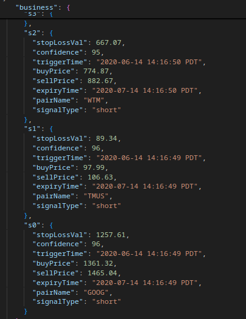

# ML project for simple Stock Prediction

I am learning basic ML, here is some code I wrote to make some predictions.

## installation

install `pandas` and `requests`

You can do it in a virtual environment.

## collect data

Run `process_stocks.sh`

it will make a file named stocks.json

## Images

Here is the result on 2020 data. It will give you a confidence level, buy sell and stop value:

